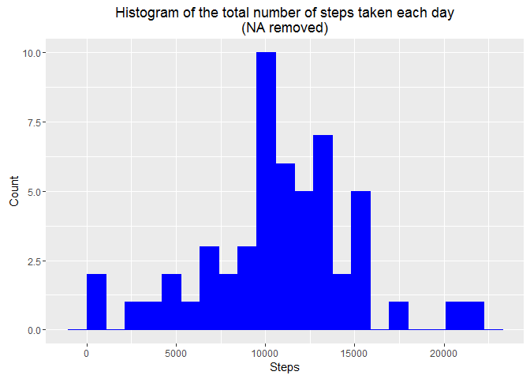
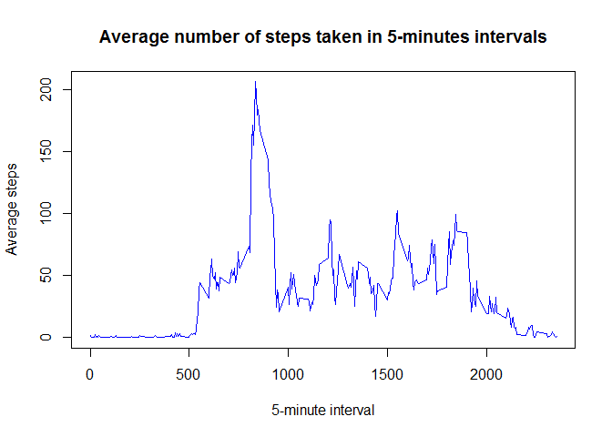
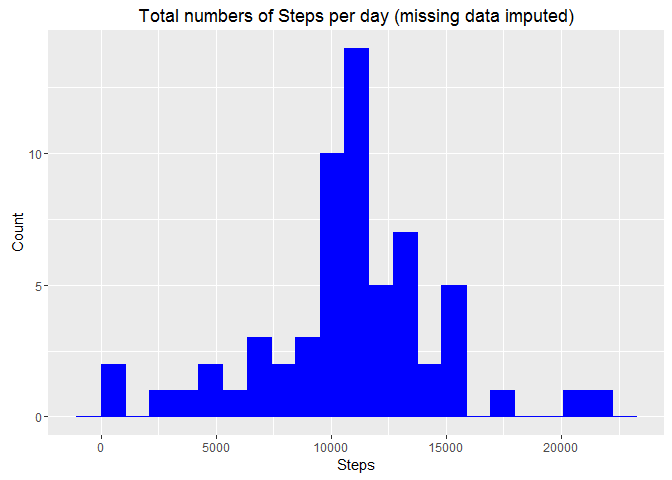
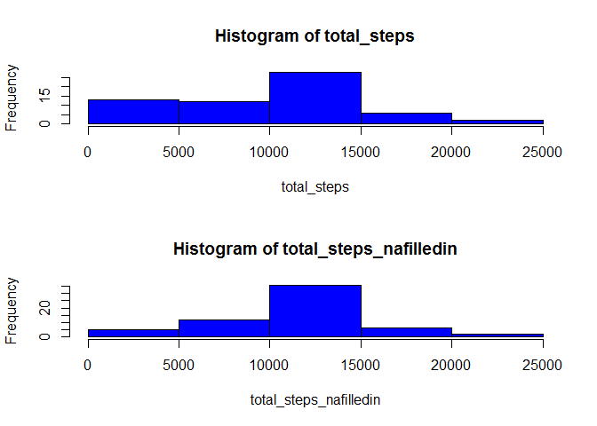

# Reproducible Research: Peer Assessment 1

## Loading and preprocessing the data


```r
if(!require(plyr)){
  install.packages("plyr")
	library(plyr)
}

if(!require(dplyr)){
  install.packages("dplyr")
	library(dplyr)
}

if(!require(lubridate)){
  install.packages("lubridate")
	library(lubridate)
}

if(!require(ggplot2)){
  install.packages("ggplot2")
	library(ggplot2)
}
```

#### ...Unzip the file and load files in the specific directory


```r
zip_file <- file.path("activity.zip")
unzip("activity.zip")
```

```r
activity <- read.csv("activity.csv",colClasses = c("numeric", "character","integer"))

dim(activity)
```

```
## [1] 17568     3
```

```r
str(activity)
```

```
## 'data.frame':	17568 obs. of  3 variables:
##  $ steps   : num  NA NA NA NA NA NA NA NA NA NA ...
##  $ date    : chr  "2012-10-01" "2012-10-01" "2012-10-01" "2012-10-01" ...
##  $ interval: int  0 5 10 15 20 25 30 35 40 45 ...
```

```r
summary(activity)
```

```
##      steps            date              interval     
##  Min.   :  0.00   Length:17568       Min.   :   0.0  
##  1st Qu.:  0.00   Class :character   1st Qu.: 588.8  
##  Median :  0.00   Mode  :character   Median :1177.5  
##  Mean   : 37.38                      Mean   :1177.5  
##  3rd Qu.: 12.00                      3rd Qu.:1766.2  
##  Max.   :806.00                      Max.   :2355.0  
##  NA's   :2304
```

```r
names(activity)
```

```
## [1] "steps"    "date"     "interval"
```

## What is mean total number of steps taken per day?
#### mean total number of steps taken per day. Ignore the missing values in the dataset.


```r
total_steps <- tapply(activity$steps, activity$date, FUN = sum, na.rm = TRUE)
activity$date <- ymd(activity$date)

mean(total_steps)
```

```
## [1] 9354.23
```

```r
median(total_steps)
```

```
## [1] 10395
```

```r
steps <- activity
steps <- filter(steps,!is.na(steps))
steps <- group_by(steps, date) 
steps <- summarize(steps, steps=sum(steps))

dim(steps)
```

```
## [1] 53  2
```

```r
class(steps)
```

```
## [1] "tbl_df"     "tbl"        "data.frame"
```

```r
str(steps)
```

```
## Classes 'tbl_df', 'tbl' and 'data.frame':	53 obs. of  2 variables:
##  $ date : POSIXct, format: "2012-10-02" "2012-10-03" ...
##  $ steps: num  126 11352 12116 13294 15420 ...
```

```r
summary(steps)
```

```
##       date                         steps      
##  Min.   :2012-10-02 00:00:00   Min.   :   41  
##  1st Qu.:2012-10-16 00:00:00   1st Qu.: 8841  
##  Median :2012-10-29 00:00:00   Median :10765  
##  Mean   :2012-10-30 17:12:27   Mean   :10766  
##  3rd Qu.:2012-11-16 00:00:00   3rd Qu.:13294  
##  Max.   :2012-11-29 00:00:00   Max.   :21194
```

```r
names(steps)
```

```
## [1] "date"  "steps"
```

```r
head(steps)
```

```
## Source: local data frame [6 x 2]
## 
##         date steps
##       (time) (dbl)
## 1 2012-10-02   126
## 2 2012-10-03 11352
## 3 2012-10-04 12116
## 4 2012-10-05 13294
## 5 2012-10-06 15420
## 6 2012-10-07 11015
```

```r
tail(steps)
```

```
## Source: local data frame [6 x 2]
## 
##         date steps
##       (time) (dbl)
## 1 2012-11-24 14478
## 2 2012-11-25 11834
## 3 2012-11-26 11162
## 4 2012-11-27 13646
## 5 2012-11-28 10183
## 6 2012-11-29  7047
```

#### ....Make a histogram of the total number of steps taken each day




## What is the average daily activity pattern?


```r
daily <- activity
daily <- filter(daily,!is.na(steps))
daily <- group_by(daily, interval) 
daily <- summarize(daily, steps=mean(steps))

dim(daily)
```

```
## [1] 288   2
```

```r
class(daily)
```

```
## [1] "tbl_df"     "tbl"        "data.frame"
```

```r
str(daily)
```

```
## Classes 'tbl_df', 'tbl' and 'data.frame':	288 obs. of  2 variables:
##  $ interval: int  0 5 10 15 20 25 30 35 40 45 ...
##  $ steps   : num  1.717 0.3396 0.1321 0.1509 0.0755 ...
```

```r
summary(daily)
```

```
##     interval          steps        
##  Min.   :   0.0   Min.   :  0.000  
##  1st Qu.: 588.8   1st Qu.:  2.486  
##  Median :1177.5   Median : 34.113  
##  Mean   :1177.5   Mean   : 37.383  
##  3rd Qu.:1766.2   3rd Qu.: 52.835  
##  Max.   :2355.0   Max.   :206.170
```

```r
names(daily)
```

```
## [1] "interval" "steps"
```

```r
head(daily)
```

```
## Source: local data frame [6 x 2]
## 
##   interval     steps
##      (int)     (dbl)
## 1        0 1.7169811
## 2        5 0.3396226
## 3       10 0.1320755
## 4       15 0.1509434
## 5       20 0.0754717
## 6       25 2.0943396
```

```r
tail(daily)
```

```
## Source: local data frame [6 x 2]
## 
##   interval     steps
##      (int)     (dbl)
## 1     2330 2.6037736
## 2     2335 4.6981132
## 3     2340 3.3018868
## 4     2345 0.6415094
## 5     2350 0.2264151
## 6     2355 1.0754717
```

#### ....A time series plot (i.e. type = "l") of the 5-minute interval (x-axis) and the average number of steps taken, averaged across all days (y-axis)



## Which 5-minute interval, on average across all the days in the dataset, contains the maximum number of steps?


```r
daily[which.max(daily$steps), ]$interval
```

```
## [1] 835
```

## Imputing missing values
#### the total number of missing values


```r
count(activity[complete.cases(activity[1,2,3]),])
```

```
## Source: local data frame [1 x 1]
## 
##       n
##   (int)
## 1 17568
```

```r
count(na.omit(activity))
```

```
## Source: local data frame [1 x 1]
## 
##       n
##   (int)
## 1 15264
```

```r
count(activity)
```

```
## Source: local data frame [1 x 1]
## 
##       n
##   (int)
## 1 17568
```

```r
count(activity)-count(na.omit(activity))
```

```
##      n
## 1 2304
```

```r
sum(is.na(activity))
```

```
## [1] 2304
```

#### Create a new dataset where missing values in the dataset are replaced with the mean/median for that 5-minute interval


```r
steps_nafilledin <- activity
steps_nafilledin <- group_by(steps_nafilledin, interval) 
steps_nafilledin <- mutate(steps_nafilledin,steps=ifelse(is.na(steps), mean(steps, na.rm=TRUE), steps))


dim(steps_nafilledin)
```

```
## [1] 17568     3
```

```r
class(steps_nafilledin)
```

```
## [1] "grouped_df" "tbl_df"     "tbl"        "data.frame"
```

```r
str(steps_nafilledin)
```

```
## Classes 'grouped_df', 'tbl_df', 'tbl' and 'data.frame':	17568 obs. of  3 variables:
##  $ steps   : num  1.717 0.3396 0.1321 0.1509 0.0755 ...
##  $ date    : POSIXct, format: "2012-10-01" "2012-10-01" ...
##  $ interval: int  0 5 10 15 20 25 30 35 40 45 ...
##  - attr(*, "vars")=List of 1
##   ..$ : symbol interval
##  - attr(*, "labels")='data.frame':	288 obs. of  1 variable:
##   ..$ interval: int  0 5 10 15 20 25 30 35 40 45 ...
##   ..- attr(*, "vars")=List of 1
##   .. ..$ : symbol interval
##   ..- attr(*, "drop")= logi TRUE
##  - attr(*, "indices")=List of 288
##   ..$ : int  0 288 576 864 1152 1440 1728 2016 2304 2592 ...
##   ..$ : int  1 289 577 865 1153 1441 1729 2017 2305 2593 ...
##   ..$ : int  2 290 578 866 1154 1442 1730 2018 2306 2594 ...
##   ..$ : int  3 291 579 867 1155 1443 1731 2019 2307 2595 ...
##   ..$ : int  4 292 580 868 1156 1444 1732 2020 2308 2596 ...
##   ..$ : int  5 293 581 869 1157 1445 1733 2021 2309 2597 ...
##   ..$ : int  6 294 582 870 1158 1446 1734 2022 2310 2598 ...
##   ..$ : int  7 295 583 871 1159 1447 1735 2023 2311 2599 ...
##   ..$ : int  8 296 584 872 1160 1448 1736 2024 2312 2600 ...
##   ..$ : int  9 297 585 873 1161 1449 1737 2025 2313 2601 ...
##   ..$ : int  10 298 586 874 1162 1450 1738 2026 2314 2602 ...
##   ..$ : int  11 299 587 875 1163 1451 1739 2027 2315 2603 ...
##   ..$ : int  12 300 588 876 1164 1452 1740 2028 2316 2604 ...
##   ..$ : int  13 301 589 877 1165 1453 1741 2029 2317 2605 ...
##   ..$ : int  14 302 590 878 1166 1454 1742 2030 2318 2606 ...
##   ..$ : int  15 303 591 879 1167 1455 1743 2031 2319 2607 ...
##   ..$ : int  16 304 592 880 1168 1456 1744 2032 2320 2608 ...
##   ..$ : int  17 305 593 881 1169 1457 1745 2033 2321 2609 ...
##   ..$ : int  18 306 594 882 1170 1458 1746 2034 2322 2610 ...
##   ..$ : int  19 307 595 883 1171 1459 1747 2035 2323 2611 ...
##   ..$ : int  20 308 596 884 1172 1460 1748 2036 2324 2612 ...
##   ..$ : int  21 309 597 885 1173 1461 1749 2037 2325 2613 ...
##   ..$ : int  22 310 598 886 1174 1462 1750 2038 2326 2614 ...
##   ..$ : int  23 311 599 887 1175 1463 1751 2039 2327 2615 ...
##   ..$ : int  24 312 600 888 1176 1464 1752 2040 2328 2616 ...
##   ..$ : int  25 313 601 889 1177 1465 1753 2041 2329 2617 ...
##   ..$ : int  26 314 602 890 1178 1466 1754 2042 2330 2618 ...
##   ..$ : int  27 315 603 891 1179 1467 1755 2043 2331 2619 ...
##   ..$ : int  28 316 604 892 1180 1468 1756 2044 2332 2620 ...
##   ..$ : int  29 317 605 893 1181 1469 1757 2045 2333 2621 ...
##   ..$ : int  30 318 606 894 1182 1470 1758 2046 2334 2622 ...
##   ..$ : int  31 319 607 895 1183 1471 1759 2047 2335 2623 ...
##   ..$ : int  32 320 608 896 1184 1472 1760 2048 2336 2624 ...
##   ..$ : int  33 321 609 897 1185 1473 1761 2049 2337 2625 ...
##   ..$ : int  34 322 610 898 1186 1474 1762 2050 2338 2626 ...
##   ..$ : int  35 323 611 899 1187 1475 1763 2051 2339 2627 ...
##   ..$ : int  36 324 612 900 1188 1476 1764 2052 2340 2628 ...
##   ..$ : int  37 325 613 901 1189 1477 1765 2053 2341 2629 ...
##   ..$ : int  38 326 614 902 1190 1478 1766 2054 2342 2630 ...
##   ..$ : int  39 327 615 903 1191 1479 1767 2055 2343 2631 ...
##   ..$ : int  40 328 616 904 1192 1480 1768 2056 2344 2632 ...
##   ..$ : int  41 329 617 905 1193 1481 1769 2057 2345 2633 ...
##   ..$ : int  42 330 618 906 1194 1482 1770 2058 2346 2634 ...
##   ..$ : int  43 331 619 907 1195 1483 1771 2059 2347 2635 ...
##   ..$ : int  44 332 620 908 1196 1484 1772 2060 2348 2636 ...
##   ..$ : int  45 333 621 909 1197 1485 1773 2061 2349 2637 ...
##   ..$ : int  46 334 622 910 1198 1486 1774 2062 2350 2638 ...
##   ..$ : int  47 335 623 911 1199 1487 1775 2063 2351 2639 ...
##   ..$ : int  48 336 624 912 1200 1488 1776 2064 2352 2640 ...
##   ..$ : int  49 337 625 913 1201 1489 1777 2065 2353 2641 ...
##   ..$ : int  50 338 626 914 1202 1490 1778 2066 2354 2642 ...
##   ..$ : int  51 339 627 915 1203 1491 1779 2067 2355 2643 ...
##   ..$ : int  52 340 628 916 1204 1492 1780 2068 2356 2644 ...
##   ..$ : int  53 341 629 917 1205 1493 1781 2069 2357 2645 ...
##   ..$ : int  54 342 630 918 1206 1494 1782 2070 2358 2646 ...
##   ..$ : int  55 343 631 919 1207 1495 1783 2071 2359 2647 ...
##   ..$ : int  56 344 632 920 1208 1496 1784 2072 2360 2648 ...
##   ..$ : int  57 345 633 921 1209 1497 1785 2073 2361 2649 ...
##   ..$ : int  58 346 634 922 1210 1498 1786 2074 2362 2650 ...
##   ..$ : int  59 347 635 923 1211 1499 1787 2075 2363 2651 ...
##   ..$ : int  60 348 636 924 1212 1500 1788 2076 2364 2652 ...
##   ..$ : int  61 349 637 925 1213 1501 1789 2077 2365 2653 ...
##   ..$ : int  62 350 638 926 1214 1502 1790 2078 2366 2654 ...
##   ..$ : int  63 351 639 927 1215 1503 1791 2079 2367 2655 ...
##   ..$ : int  64 352 640 928 1216 1504 1792 2080 2368 2656 ...
##   ..$ : int  65 353 641 929 1217 1505 1793 2081 2369 2657 ...
##   ..$ : int  66 354 642 930 1218 1506 1794 2082 2370 2658 ...
##   ..$ : int  67 355 643 931 1219 1507 1795 2083 2371 2659 ...
##   ..$ : int  68 356 644 932 1220 1508 1796 2084 2372 2660 ...
##   ..$ : int  69 357 645 933 1221 1509 1797 2085 2373 2661 ...
##   ..$ : int  70 358 646 934 1222 1510 1798 2086 2374 2662 ...
##   ..$ : int  71 359 647 935 1223 1511 1799 2087 2375 2663 ...
##   ..$ : int  72 360 648 936 1224 1512 1800 2088 2376 2664 ...
##   ..$ : int  73 361 649 937 1225 1513 1801 2089 2377 2665 ...
##   ..$ : int  74 362 650 938 1226 1514 1802 2090 2378 2666 ...
##   ..$ : int  75 363 651 939 1227 1515 1803 2091 2379 2667 ...
##   ..$ : int  76 364 652 940 1228 1516 1804 2092 2380 2668 ...
##   ..$ : int  77 365 653 941 1229 1517 1805 2093 2381 2669 ...
##   ..$ : int  78 366 654 942 1230 1518 1806 2094 2382 2670 ...
##   ..$ : int  79 367 655 943 1231 1519 1807 2095 2383 2671 ...
##   ..$ : int  80 368 656 944 1232 1520 1808 2096 2384 2672 ...
##   ..$ : int  81 369 657 945 1233 1521 1809 2097 2385 2673 ...
##   ..$ : int  82 370 658 946 1234 1522 1810 2098 2386 2674 ...
##   ..$ : int  83 371 659 947 1235 1523 1811 2099 2387 2675 ...
##   ..$ : int  84 372 660 948 1236 1524 1812 2100 2388 2676 ...
##   ..$ : int  85 373 661 949 1237 1525 1813 2101 2389 2677 ...
##   ..$ : int  86 374 662 950 1238 1526 1814 2102 2390 2678 ...
##   ..$ : int  87 375 663 951 1239 1527 1815 2103 2391 2679 ...
##   ..$ : int  88 376 664 952 1240 1528 1816 2104 2392 2680 ...
##   ..$ : int  89 377 665 953 1241 1529 1817 2105 2393 2681 ...
##   ..$ : int  90 378 666 954 1242 1530 1818 2106 2394 2682 ...
##   ..$ : int  91 379 667 955 1243 1531 1819 2107 2395 2683 ...
##   ..$ : int  92 380 668 956 1244 1532 1820 2108 2396 2684 ...
##   ..$ : int  93 381 669 957 1245 1533 1821 2109 2397 2685 ...
##   ..$ : int  94 382 670 958 1246 1534 1822 2110 2398 2686 ...
##   ..$ : int  95 383 671 959 1247 1535 1823 2111 2399 2687 ...
##   ..$ : int  96 384 672 960 1248 1536 1824 2112 2400 2688 ...
##   ..$ : int  97 385 673 961 1249 1537 1825 2113 2401 2689 ...
##   ..$ : int  98 386 674 962 1250 1538 1826 2114 2402 2690 ...
##   .. [list output truncated]
```

```r
summary(steps_nafilledin)
```

```
##      steps             date               interval     
##  Min.   :  0.00   Min.   :2012-10-01   Min.   :   0.0  
##  1st Qu.:  0.00   1st Qu.:2012-10-16   1st Qu.: 588.8  
##  Median :  0.00   Median :2012-10-31   Median :1177.5  
##  Mean   : 37.38   Mean   :2012-10-31   Mean   :1177.5  
##  3rd Qu.: 27.00   3rd Qu.:2012-11-15   3rd Qu.:1766.2  
##  Max.   :806.00   Max.   :2012-11-30   Max.   :2355.0
```

```r
names(steps_nafilledin)
```

```
## [1] "steps"    "date"     "interval"
```

#### Make a histogram of the total number of steps taken each day.


```r
steps_nafilledin_days <- steps_nafilledin
steps_nafilledin_days <- group_by(steps_nafilledin_days, date) 
steps_nafilledin_days <- summarize(steps_nafilledin_days,steps=sum(steps))

dim(steps_nafilledin_days)
```

```
## [1] 61  2
```

```r
class(steps_nafilledin_days)
```

```
## [1] "tbl_df"     "tbl"        "data.frame"
```

```r
str(steps_nafilledin_days)
```

```
## Classes 'tbl_df', 'tbl' and 'data.frame':	61 obs. of  2 variables:
##  $ date : POSIXct, format: "2012-10-01" "2012-10-02" ...
##  $ steps: num  10766 126 11352 12116 13294 ...
```

```r
summary(steps_nafilledin_days)
```

```
##       date                steps      
##  Min.   :2012-10-01   Min.   :   41  
##  1st Qu.:2012-10-16   1st Qu.: 9819  
##  Median :2012-10-31   Median :10766  
##  Mean   :2012-10-31   Mean   :10766  
##  3rd Qu.:2012-11-15   3rd Qu.:12811  
##  Max.   :2012-11-30   Max.   :21194
```

```r
names(steps_nafilledin_days)
```

```
## [1] "date"  "steps"
```

```r
head(steps_nafilledin_days)
```

```
## Source: local data frame [6 x 2]
## 
##         date    steps
##       (time)    (dbl)
## 1 2012-10-01 10766.19
## 2 2012-10-02   126.00
## 3 2012-10-03 11352.00
## 4 2012-10-04 12116.00
## 5 2012-10-05 13294.00
## 6 2012-10-06 15420.00
```

```r
tail(steps_nafilledin_days)
```

```
## Source: local data frame [6 x 2]
## 
##         date    steps
##       (time)    (dbl)
## 1 2012-11-25 11834.00
## 2 2012-11-26 11162.00
## 3 2012-11-27 13646.00
## 4 2012-11-28 10183.00
## 5 2012-11-29  7047.00
## 6 2012-11-30 10766.19
```



#### ....Calculate and report the mean and median total number of steps taken per day of the new dataset. Do these values differ from the estimates from the first part of the assignment?


```r
steps_nafilledin$date <- ymd(steps_nafilledin$date)
total_steps_nafilledin <- tapply(steps_nafilledin$steps, steps_nafilledin$date, FUN = sum, na.rm = TRUE)


mean(total_steps_nafilledin)
```

```
## [1] 10766.19
```

```r
median(total_steps_nafilledin)
```

```
## [1] 10766.19
```

```r
mean(total_steps)==mean(total_steps_nafilledin)
```

```
## [1] FALSE
```

```r
median(total_steps)==median(total_steps_nafilledin)
```

```
## [1] FALSE
```

```r
summary(total_steps)
```

```
##    Min. 1st Qu.  Median    Mean 3rd Qu.    Max. 
##       0    6778   10400    9354   12810   21190
```

```r
summary(total_steps_nafilledin)
```

```
##    Min. 1st Qu.  Median    Mean 3rd Qu.    Max. 
##      41    9819   10770   10770   12810   21190
```

#### ....What is the impact of imputing missing data on the estimates of the total daily number of steps?  The estimates of the number of steps increased by 41, 3041, 370, 1416, 0, 0.


```
##    Min. 1st Qu.  Median    Mean 3rd Qu.    Max. 
##     -41   -3041    -370   -1416       0       0
```



## What are the differences in activity patterns between weekdays and weekends? 
#### the dataset used in this part has filled-in missing values. 


```r
dayofweek <- function(date) {
    if (weekdays(as.Date(date)) %in% c("Saturday", "Sunday")) {
        "weekend"
    } else {
        "weekday"
    }
}
steps_nafilledin$daytype <- as.factor(sapply(steps_nafilledin$date, dayofweek))
```

#### ....A panel plot containing a time series plot (i.e. type = "l") of the 5-minute interval (x-axis) and the average number of steps taken, averaged across all weekday days or weekend days (y-axis). 


```r
par(mfrow = c(2, 1))
for (type in c("weekend", "weekday")) {
    steps_split <- aggregate(steps ~ interval, data = steps_nafilledin, subset = steps_nafilledin$daytype == 
        type, FUN = mean)
    plot(steps_split, type = "l", main = type)
}
```


